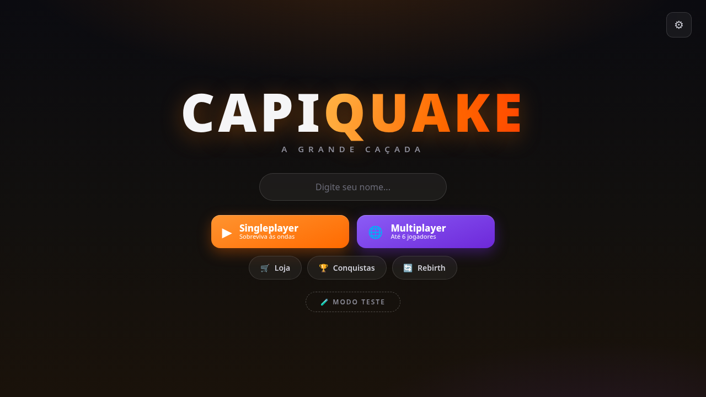
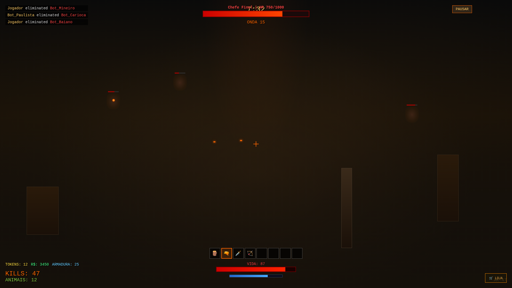
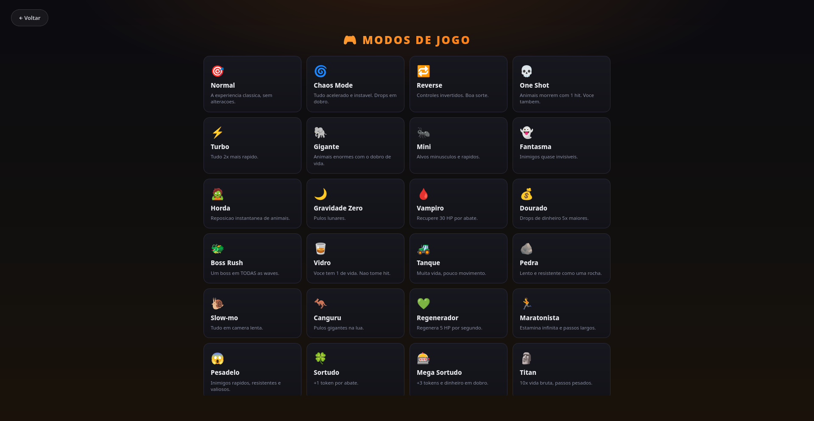
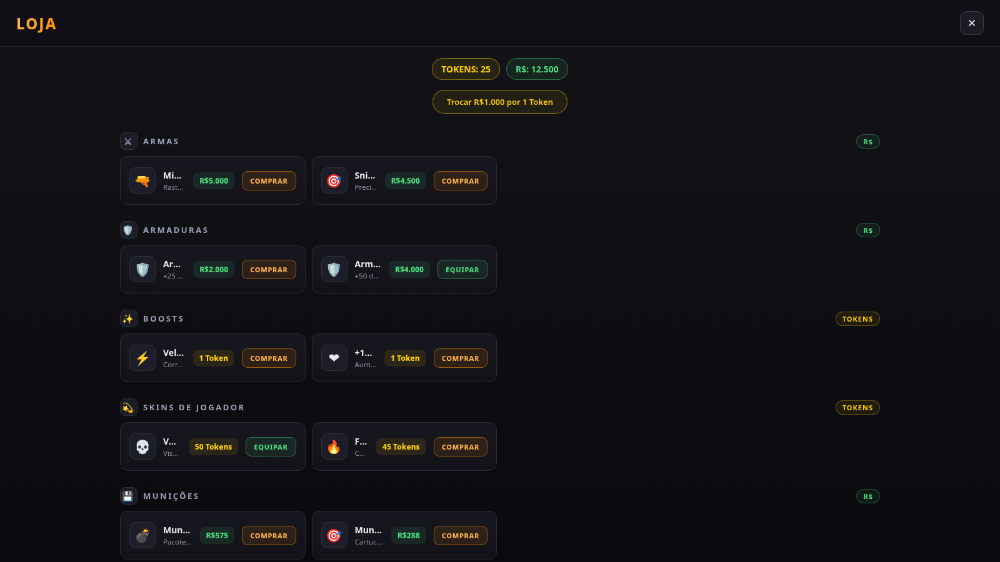
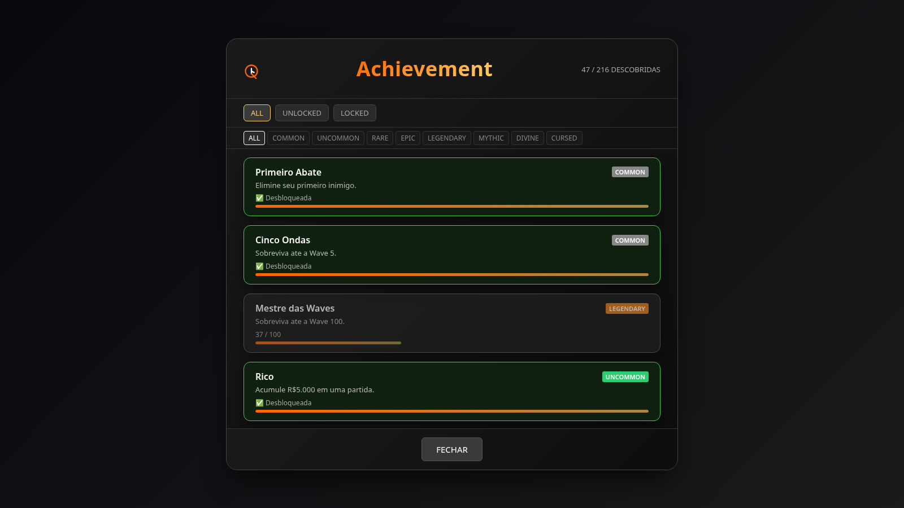
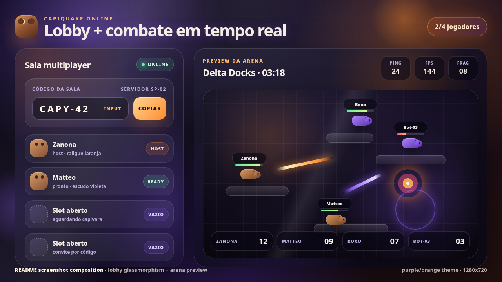
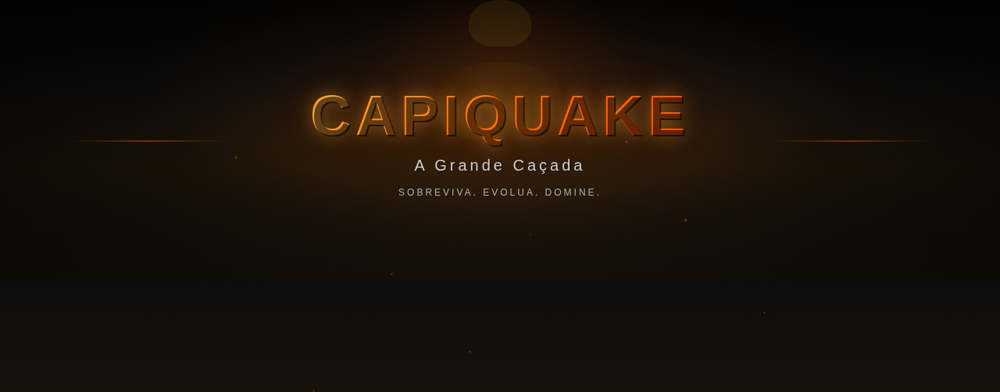

<div align="center">

# 🔥 CAPIQUAKE

**A Grande Caçada**

Sobreviva. Evolua. Domine.

[](https://developer.mozilla.org/pt-BR/docs/Web/HTML)
[](https://developer.mozilla.org/pt-BR/docs/Web/JavaScript)
[](https://threejs.org/)
[](https://developer.mozilla.org/pt-BR/docs/Web/API/WebSocket)

**🎮 Jogue agora: [reicapivararbx.github.io/capyquake](https://reicapivararbx.github.io/capyquake/)**

**📚 Wiki do jogo: [wiki/Home.md](wiki/Home.md)** — armas, loja, conquistas, modos, bestiário e multiplayer

</div>

---

## 🎮 Sobre o Jogo

**CapiQuake** é um FPS 3D de arena onde você caça capivaras mutantes. Enfrente ondas crescentes de animais, compre 75+ armas na loja, evolua com níveis e rebirths, desbloqueie conquistas e enfrente bosses — sozinho ou com até 6 jogadores.

### ⚔️ Funcionalidades

- **⚔️ Combate em Arena** — 75 armas corpo a corpo e à distância com modelos 3D próprios
- **🛒 Loja Completa** — 452 itens: armas, munições, armaduras, boosts, habilidades, encantamentos, skins e revives
- **🏆 236 Conquistas** — 9 raridades, de Common à secreta **???**, com recompensas em dinheiro e tokens
- **🎮 33 Modos de Jogo** — Chaos, Reverse, One Shot, Boss Rush, Titan, Fantasma e muito mais
- **👥 Multiplayer com Lobby** — Crie um lobby com código de 4 letras ou entre no de um amigo · só o host escolhe mapa e inicia
- **🗺️ 30 Mapas** — Floresta Encantada até Planeta Alienígena, cada um com boss final
- **💰 Economia** — Tokens e Reais (R$) com troca entre moedas
- **🔄 Rebirth** — Zere seu progresso por bônus permanentes e Rebirth Tokens (RT)
- **📱 Mobile** — Joystick virtual, botões touch e HUD adaptativo
- **⌨️ Teclas Customizáveis** — Remapeie tudo nas configurações

---

## 📸 Screenshots

<div align="center">

### Menu Principal


### Gameplay


### Modos de Jogo


### Loja


### Conquistas


### Multiplayer


### Banner Promocional


</div>

---

## 🎯 Como Jogar

### Controles (padrão — customizáveis no ⚙)

| Ação | Tecla |
|------|-------|
| Mover | W, A, S, D |
| Olhar | Mouse |
| Atirar | Botão Esquerdo |
| Correr | Shift |
| Pular | Espaço |
| Pegar item / abrir baú | E |
| Habilidade Void | F |
| Alternar câmera 1ª/3ª pessoa | F3 |
| Soltar o peido | T |
| Emotes | B |
| Mira da sniper | Ctrl |
| Inventário | Esc |
| Soltar arma | Z |
| Granada / Teleporte | G |
| Rush de velocidade | H |
| Pausar | P |

No **celular**: joystick virtual + botões ATK, JUMP, SPR, ABL, 📷 câmera e 🎒 inventário.

### Modos de Jogo (33)

Além do **Normal**, experimente: Chaos Mode, Reverse, One Shot, Turbo, Gigante, Mini, Fantasma, Horda, Gravidade Zero, Vampiro, Dourado, **Boss Rush**, Vidro, Tanque, Pedra, Slow-mo, Canguru, Regenerador, Maratonista, Pesadelo, Sortudo, Mega Sortudo, Titan, Fúria, Elástico, Formigueiro, Colosso, Zumbi, Ninja, Rocha Viva, Cacique e Imortal.

Cada modo altera a partida de verdade — velocidade, vida, escala dos animais, drops, gravidade e mais.

### Waves e Bosses

- Waves normais: 1–4, 6–9, 11–14...
- **Mini-boss**: toda wave múltipla de 5
- **Boss principal**: toda wave múltipla de 10

---

## 🛠️ Stack Técnica

| Tecnologia | Uso |
|------------|-----|
| **Three.js** | Motor 3D, renderização, física |
| **WebSocket (ws)** | Multiplayer online em tempo real |
| **Vite** | Build e dev server |
| **HTML5/CSS3** | UI, menus, HUD |
| **Vanilla JavaScript** | Lógica do jogo, sem frameworks |
| **Node.js** | Servidor multiplayer |

---

## 🚀 Como Executar

### Requisitos

- [Node.js](https://nodejs.org/) 18+
- npm

### Instalação

```bash
git clone https://github.com/reicapivararbx/capyquake.git
cd capyquake
npm install
```

### Jogar offline / Multiplayer

```bash
# Sobe o jogo + servidor WebSocket na porta 8080
node server/index.js
```

Abra `http://localhost:8080`. Amigos na mesma rede usam `http://SEU-IP:8080` (o servidor mostra o IP).

**Multiplayer:** Multiplayer → **Criar Lobby** (gera código de 4 letras) → envie o código pros amigos → **Entrar** com o código. Só o host escolhe o mapa e inicia.

### Desenvolvimento

```bash
npx vite dev    # dev server com hot-reload (porta 3000)
npx vite build  # build de produção em dist/
```

### Site público

O build publicado fica em `gh-pages`. Para atualizá-lo após um `npx vite build`, copie o conteúdo de `dist/` para a branch `gh-pages`.

---

## 📁 Estrutura do Projeto

```
capyquake/
├── index.html               # HTML principal + estilos das telas
├── shop.css                 # Estilo da loja
├── vite.config.js           # Configuração do Vite
├── server/
│   └── index.js             # Servidor estático + WebSocket (lobbies)
├── src/
│   ├── main.js              # Bootstrap, telas, easter eggs
│   ├── game.js              # Núcleo: waves, combate, economia, conquistas
│   ├── game-modes.js        # 33 modos de jogo
│   ├── player.js            # Movimento, câmera, stamina
│   ├── weapon.js            # Armas, tiro, modelos 3D
│   ├── animals.js           # 96 animais com IA e animação
│   ├── boss.js              # Boss e mini-boss
│   ├── arena.js             # Arena, salas e colisões
│   ├── maps.js              # 30 mapas
│   ├── renderer.js          # Cena, luzes, céu
│   ├── hud.js               # HUD in-game
│   ├── menu.js              # Menu, loja, lobby
│   ├── network.js           # Cliente WebSocket
│   ├── keybindings.js       # Teclas customizáveis
│   ├── achievements-data.js # 236 conquistas + recompensas
│   ├── shop-data.js         # Catálogo da loja (452 itens)
│   ├── device.js            # Detecção PC/mobile
│   └── controls-mobile.js   # Controles touch
└── assets/
    └── templates/           # Screenshots e templates do README
```

---

## 🏆 Conquistas

**236 conquistas** em 9 raridades — cada uma paga recompensa:

| Raridade | Recompensa | Exemplo |
|----------|-----------|---------|
| **COMMON** | R$ 250 | Primeiro Abate |
| **UNCOMMON** | R$ 500 | Rico |
| **RARE** | R$ 1.500 + 1 token | Exterminador |
| **EPIC** | R$ 3.000 + 2 tokens | Lenda Viva |
| **LEGENDARY** | R$ 7.500 + 4 tokens | Mestre das Waves |
| **MYTHIC** | R$ 15.000 + 8 tokens | Lenda das Armas |
| **DIVINE** | R$ 40.000 + 15 tokens | Conquista Divina |
| **CURSED** | R$ 1.000 + 3 tokens | Masoquista |
| **???** | 🔄 Revive Infinity | *???* |

Destaque: a conquista secreta **"???"**, a mais difícil de todas — um progresso em **3 partes** (com barra de progresso) que exige bilhões de dano, dezenas de milhares de abates, 20 renascimentos e a MINIGUN. Completar as 3 partes desbloqueia o **Revive Infinity** de vez.

Destaques: conquistas para cada um dos 33 modos, a cadeia **"Além da Vida"** (5 etapas que também leva ao Revive Infinity) e **"Colecionador de Modos"** (jogue todos os modos).

---

## 🔄 Rebirth

Chegou no nível 100 com 10.000 tokens e R$ 1.000.000? Faça **Rebirth** pelo menu:

- Zera nível, XP, dinheiro e tokens
- Ganha **+1 RT** (Rebirth Token · troque por 1.000.000 tokens no painel de rebirth ou na loja)
- **Bônus exponenciais**: a cada rebirth, o multiplicador de dinheiro, tokens, XP e HP é elevado ao quadrado — ×2 → ×4 → ×16 → ×256 → ×65.536...

---

## 🎨 Assets Visuais

- **`assets/style-guide.md`** — Paleta de cores, tipografia e regras visuais
- **`assets/ai-prompts.md`** — Prompts para geração de imagens com IA
- **`assets/templates/`** — Templates HTML para captura de tela (1920×1080)

---

## 📄 Licença

Este projeto é de uso educacional. Os assets e código são fornecidos "como estão" sem garantias.

---

<div align="center">

Feito com ❤️Amor❤️ e muitas capivaras

</div>
